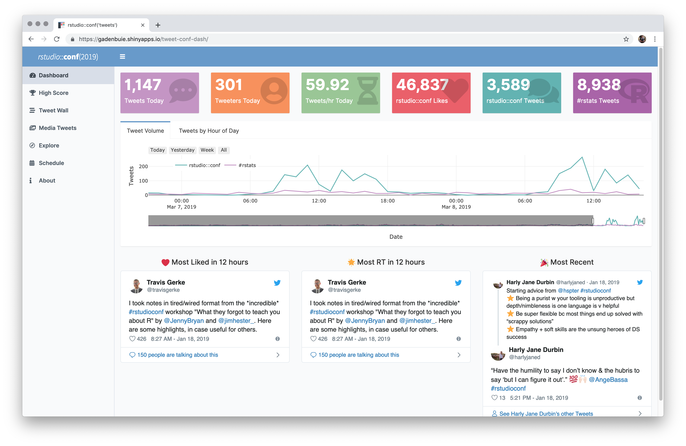
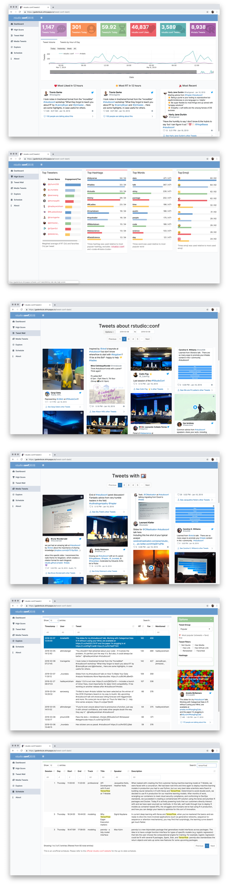

# Tweet Conference Dashboard

## Check It Out

- Try a demo of the app on [shinyapps.io][app-shinyapps] or [my personal webpage][app-grrrck].

- Launch this project in an [RStudio Cloud session][app-rstudio-cloud].

## Hyper-Focused Conference Twitter

This dashboard is designed to provide a clean, accessible, hyper-focused interface to explore and monitor tweets sent during a conference, event, or gathering (IRL or online).

Currently, the dashboard includes the following tabs and features:

- &#x1F4C8; **Dashboard** 

    The opening page show a few statistics about the current volume of tweeting about the conference. If the conference is part of a larger Twitter community, you can also display overall statistics about tweeting in that community. For example, **rstudio::conf** tweets are from members of the broader **#rstats** Twitter community.
    
    The front page also includes the top retweeted and liked tweets from a configurable time window, such as 12 hours, and the most recent tweet sent.
    
- &#x1F3C6; **High Score** 

    The high score tab gives a "leaderboard" for users, hashtags, words, and emojis for tweets about the conference. This can be a fun way to gauge topics of disucssion, attendee or participant experiences, or to motivate users to participate.

- &#x1F3B0; **Tweet Wall** 

    The **Tweet Wall** shows all of the tweets from the conference in a Pinterest-style wall. Users can quickly scan and read the stream of tweets from the conference or event. Additional, configurable date filters allow users to look for tweets from particular date ranges.

- &#x1F4F8; **Media Tweet Wall** 

    The _Media Tweet Wall_ is another wall of tweets containing only tweets with pictures or videos. In addition to the occasional gif, this tab provides an overview of the pictures being published from the conference venue.

- &#x1F50D; **Searchable Table of Tweets** 

    It is notoriously difficult to use Twitter's search features to find specific tweets. The **Explore** tab provides a searchable [dataTable] of tweets with a number of pre-specified filters. Users can search for text in any field or sort by date or number of favorites or likes. Clicking on a tweet in the table shows the tweet alongside the table in its original context.
    
- &#x1F4C6; **Conference Schedule**

    Conference schedules also tend to be difficult to search and interact with. But if a downloadable (or scrapable) conference schedule is available, it can be embedded directly into the app with the full search and ordering capabilities of [dataTables]. If a tidy schedule table isn't available, the tab's link can point directly to the conference or event schedule on an external website.
    
- &#x1F4F1; **Looks Great on Mobile**

    The dashboard is built on [AdminLTE] and [Bootstrap] with a fully responsive design. All of the main features work well on mobile — including the landing page, the high scores and the walls of tweets. The tabs that use [dataTables] try hard, too!
    
## &#x1F64F; Thank you!

This dashboard was built using many great tools in the R ecosystem. Thanks to all of the developers of these open source packages:

- [shiny]
- [rtweet]
- [shinydashboard]
- [plotly]
- [tidyverse]
- [shinycssloaders]
- [DT]

...and many more. For a full list of project dependencies, see [deps.yaml](deps.yaml).

I also built a few things to make this work, including:

- [gathertweet] - A command line tool for gathering tweets from Twitter search streams. Removes the boilerplate of collecting Twitter data and plays nicely with `cron`.

- [shinyThings] - [shiny] modules for pagination and dropdown buttons.

- [shinydashboard][shinydashboard-fork] (fork) - I forked [shinydashboard] to add a few features I needed to make this work the way I wanted.

- [adminlte-ocean-next] - An [AdminLTE] dashboard color theme.
    
---

This dashboard was built by [Garrick Aden-Buie][garrick-home] and is released under an [MIT license][mit-license].

You are welcome to re-use and/or customize this dashboard! If you do, I kindly request that you provide credit and link back to the [source repo][repo] or my [personal webpage][garrick-home]. Thank you!

[gathertweet]: https://github.com/gadenbuie/gathertweet
[shinythings]: https://github.com/gadenbuie/shinythings
[shinydashboard-fork]: https://github.com/gadenbuie/shinydashboard/tree/dev
[adminlte-ocean-next]: https://github.com/gadenbuie/AdminLTE/tree/ocean-next
[datatable]: https://www.datatables.net/
[datatables]: https://www.datatables.net/
[app-rstudio-cloud]: https://rstudio.cloud/spaces/12362/project/258314
[app-grrrck]: https://apps.garrickadenbuie.com/rstudioconf-2019/
[app-shinyapps]: https://gadenbuie.shinyapps.io/tweet-conf-dash/
[mit-license]: https://choosealicense.com/licenses/mit/
[garrick-home]: https://www.garrickadenbuie.com
[repo]: https://github.com/gadenbuie/tweet-conf-dash/
[shiny]: http://shiny.rstudio.com/
[rtweet]: https://rtweet.info
[shinydashboard]: https://rstudio.github.io/shinydashboard/
[plotly]: https://plot.ly/
[tidyverse]: https://tidyverse.org
[shinycssloaders]: https://github.com/andrewsali/shinycssloaders
[DT]: https://rstudio.github.io/DT/
[adminlte]: https://adminlte.io/
[bootstrap]: https://getbootstrap.com/
